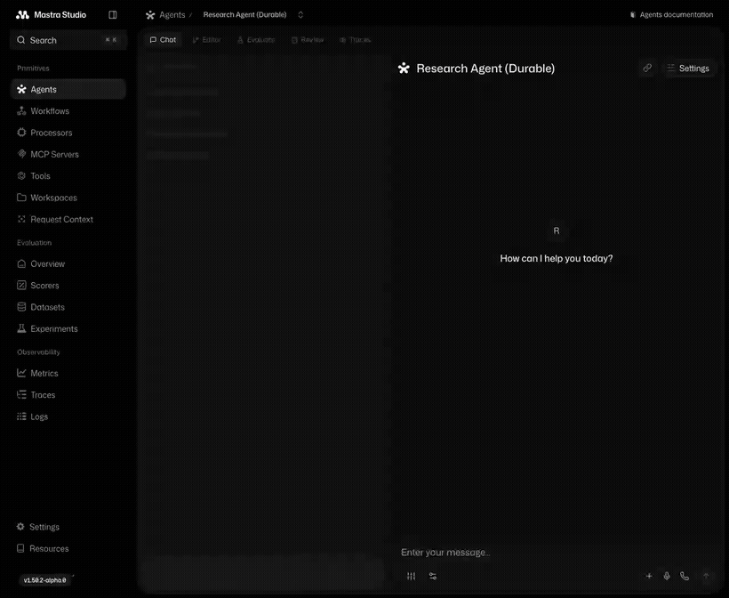

# @s2-dev/mastra-pubsub

Durable [Mastra](https://mastra.ai) `PubSub` backed by [S2](https://s2.dev) for [Durable Agents](https://mastra.ai/blog/introducing-durable-agents).

Each durable topic maps to one S2 stream. S2 provides both retained history and live delivery through a read session. Its sequence number becomes the Mastra event `index`, so refreshes, process restarts, and cross-process observers resume from the same durable log.

## Demo

The custom browser demo in [examples/durable-agents](examples/durable-agents) shows a Mastra Durable Agent streaming through S2, handling a browser refresh, and replaying from the same durable log.



Run the included browser demo:

```bash
cd examples/durable-agents
cp .env.example .env
# Fill in S2_ACCESS_TOKEN, S2_BASIN, and OPENAI_API_KEY.
bun install
bun start
```

Every conversation gets its own link at `/chat/<runId>`. A refresh, a second
tab, or someone else opening the link all replay the same run from S2. Once
Mastra clears a finished run's topic (`cleanupTimeoutMs`), the link returns 404
instead of hanging.

There is also a CLI walkthrough (`bun run cli`) that streams a run, then
reconnects three times and checks each replay matches.

## Install

```bash
npm install @s2-dev/mastra-pubsub @mastra/core @s2-dev/streamstore
```

`@mastra/core` is a peer dependency. `@s2-dev/streamstore` is a direct dependency.

## Setup

Create an S2 [access token](https://s2.dev/docs/access-control) and a basin with **create-stream-on-append** and **create-stream-on-read** enabled in the [dashboard](https://s2.dev/dashboard)

```ts
import { Mastra } from "@mastra/core";
import { S2PubSub } from "@s2-dev/mastra-pubsub";

const pubsub = new S2PubSub({
  accessToken: process.env.S2_ACCESS_TOKEN!,
  basin: process.env.S2_BASIN!,
});

const mastra = new Mastra({
  storage, // your persistent Mastra storage adapter
  pubsub,
});
```

No separate cache or in-memory live transport is required for durable agent topics.

## Configuration

`S2PubSubConfig`:

| Field | Description |
| --- | --- |
| `client` | An existing `S2` client. Takes precedence over `accessToken`. |
| `accessToken` | S2 access token, used to build a client when `client` is omitted. |
| `basin` | Basin for the durable streams. Enable `create-stream-on-append` and `create-stream-on-read`. |
| `endpoints` | Optional endpoint overrides, for example for `s2-lite`. |

`S2PubSubOptions`:

| Field | Description |
| --- | --- |
| `inner` | Local transport for non-S2 topics and explicit `localOnly` events. Defaults to `EventEmitterPubSub`. |
| `streamPrefix` | S2 stream-name prefix. Defaults to `mastra/durable/`. |
| `topicPrefix` | Only topics with this prefix use S2. Defaults to `agent.`, covering `agent.stream.<runId>` and `agent.thread-stream.<key>`. |
| `logger` | Optional Mastra logger for swallowed/background PubSub failures. Falls back to `console.error`. |

## How it works

- **publish** appends once to S2. The read session delivers the stored record locally and to other processes.
- **subscribe** opens one read session at the live tail (`tailOffset: 0`). After the first delivered record, any reconnect resumes from the next exact sequence number.
- **subscribeFromOffset** opens one S2 read session at the exact offset. That session replays retained records and then stays open for live records, so there is no replay/live handoff gap.
- **getHistory** reads S2 from the requested offset. `index` equals `seqNum`. Non-event records are filtered out client side; see [Distributed leases](#distributed-leases).
- **clearTopic** cancels every observer for the topic and best-effort deletes the stream.

S2 is the only authoritative state for durable topics. Each active callback has one ephemeral read-session handle and reconnect cursor; the adapter keeps no event history, replay cache, or durable cursor in process memory. Call `await pubsub.close()` during graceful shutdown to cancel active read sessions.

## Delivery semantics

Publishing rejects when S2 does not acknowledge the append; it never falls back to a process-local event. S2's default append retry policy is at-least-once, so an ambiguous timeout can produce a duplicate record. If duplicates are not acceptable, configure the SDK with `appendRetryPolicy: "noSideEffects"` and pass that client in:

```ts
import { S2 } from "@s2-dev/streamstore";

const client = new S2({
  accessToken: process.env.S2_ACCESS_TOKEN!,
  retry: { appendRetryPolicy: "noSideEffects" },
});

const pubsub = new S2PubSub({ client, basin: process.env.S2_BASIN! });
```

Persisted-topic consumer groups are rejected because this adapter implements broadcast observation, matching durable-agent stream semantics.

## Distributed leases

`getLeaseProvider()` returns an `S2LeaseProvider`, which Mastra's signals runtime uses to elect a single owner per thread key across processes. A lease key identifies both a thread and its topic, so lease state lives **in that thread's own stream**: one stream per thread carries its events and its coordination state.

- **Records.** Lease state is a header-tagged record holding `{ owner, expiresAt, token }`. It and S2 command records (`fence`, `trim`) are filtered out client side, but they still consume sequence numbers — resume from `last.index + 1`, not from `events.length`.
- **Writes** are conditional on a **fencing token**, so event traffic never conflicts with them. Taking ownership (`acquireLease`, `transferLease`) appends `fence` with a fresh token plus the new state in one atomic append, conditional on the old token: no unowned window on transfer, and the previous owner is fenced off. `renewLease` and `releaseLease` rewrite state under the existing token — holding it is what proves ownership, since a takeover would have rotated it. A first acquisition falls back to `matchSeqNum` on the tail.
- **Reads** find the newest lease state by scanning to the tail: a bounded window of records first, then a fixed time window only if that misses. `expiresAt` is `writeTime + ttl`, so older state is provably expired. The window is sized from `MAX_LEASE_TTL_MS` (60s) rather than the caller's TTL, because a reader cannot know what TTL the *incumbent* used — so **TTLs above 60s are clamped to it**, with a warning on the first clamp. Mastra's default is 15s; if you raise `MASTRA_AGENT_THREAD_LEASE_TTL_MS` past a minute, lower it again so renewals stay ahead of expiry.
- **No local state.** Every call reads the stream, so any process can drive a lease it owns and restarts change nothing. Expiry is wall-clock: keep clocks in sync (NTP) and TTLs well above the expected skew.
- **No trimming**, since it would drop the events ahead of the lease state; an active run adds one small record per `ttl/3`. `clearTopic` deletes the stream, so avoid it on a thread topic while a lease is held.

The effective replay window is the shorter of S2 retention and Mastra's durable-agent cleanup window. Mastra clears a terminal run's topic after `cleanupTimeoutMs` (30 seconds by default); set it to `0` to retain the S2 stream until explicit cleanup or S2 retention removes it. A request for history that has already been trimmed fails instead of silently returning a partial transcript.

## Testing

The integration test needs an S2 access token:

```bash
S2_ACCESS_TOKEN=... npm test
```

To run against a local `s2-lite`, set `S2_ACCOUNT_ENDPOINT` and `S2_BASIN_ENDPOINT`.

## License

MIT
